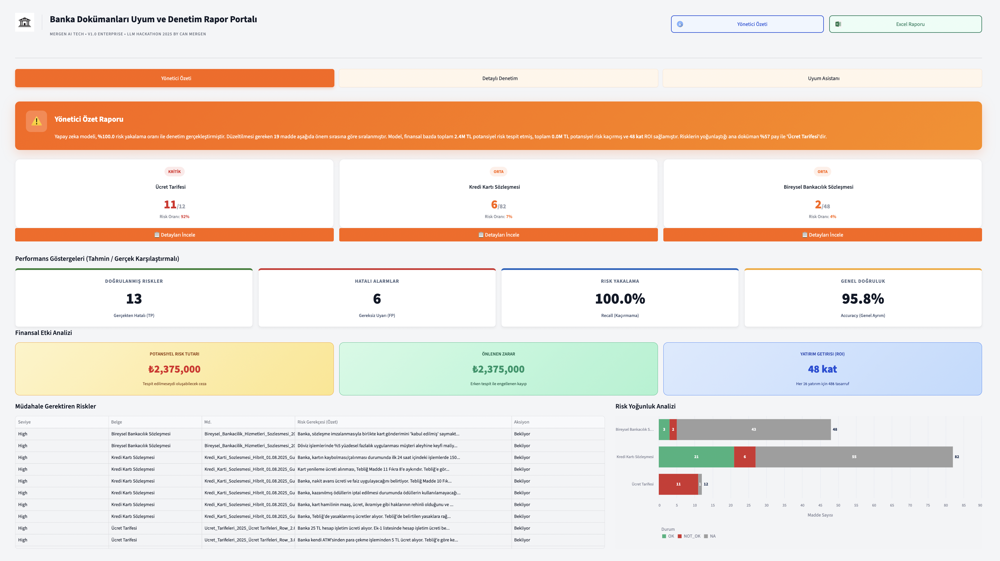
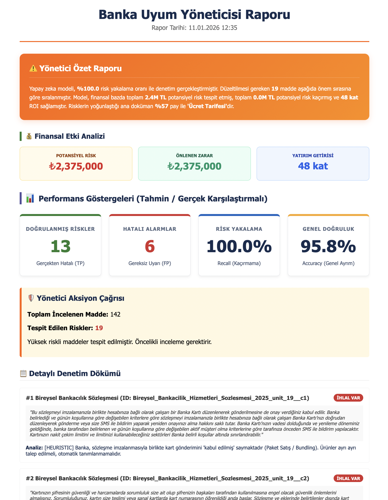
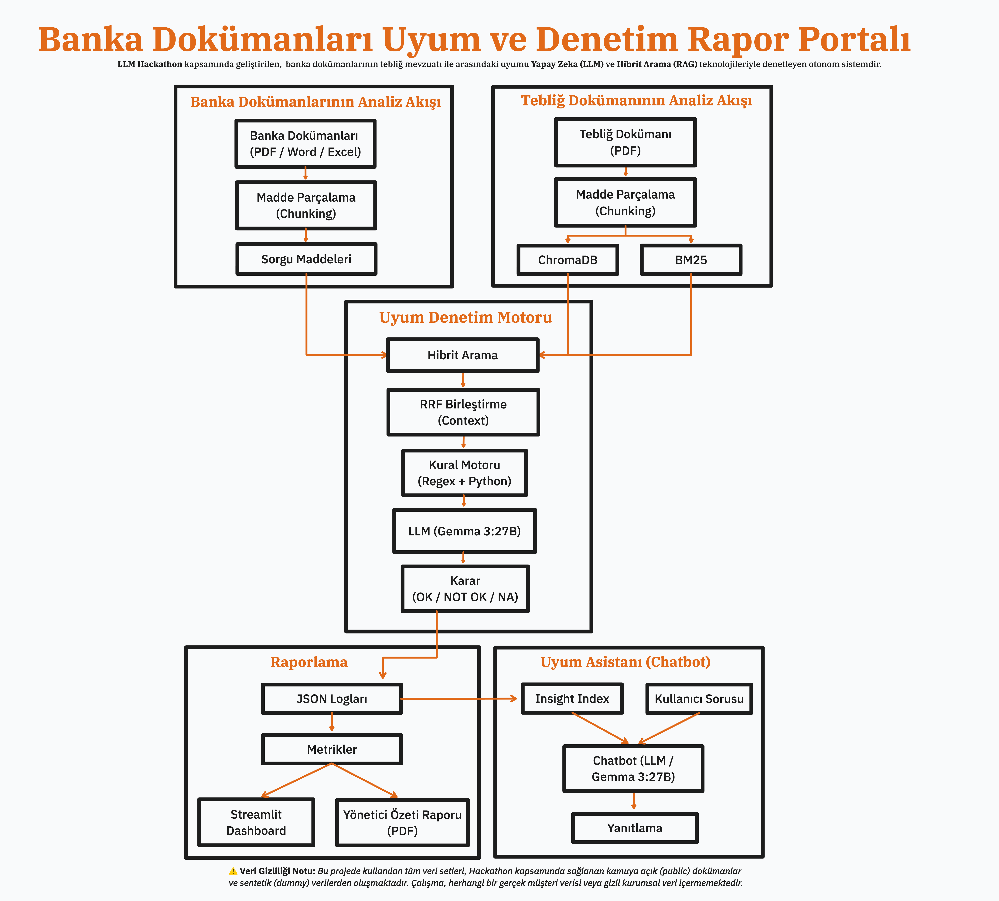

# Banka Dokümanları Uyum ve Denetim Rapor Portalı

> **LLM Hackathon** kapsamında geliştirilen, BDDK mevzuatı ile banka sözleşmeleri arasındaki uyumu **Yapay Zeka (LLM)** ve **Hibrit Arama (RAG)** teknolojileriyle denetleyen otonom sistemdir.


-purple?style=flat&logo=ollama)


> ⚠️ **Veri Gizliliği Notu:** Bu projede kullanılan tüm veri setleri, Hackathon kapsamında sağlanan kamuya açık (public) dokümanlar ve sentetik (dummy) verilerden oluşmaktadır. Çalışma, herhangi bir gerçek müşteri verisi veya gizli kurumsal veri içermemektedir.

---

## Proje Vizyonu

**Mevcut Süreç:** 
Bankaların **Müşteri Sözleşmeleri** ve **Ücret Tarifeleri**'nin mevzuata uyumu, uzman hukukçular tarafından manuel olarak kontrol edilmektedir. Bu süreç:
*   **Yavaş:** Bir sözleşme analizi saatler sürer.
*   **Pahalı:** Uzman eforu yüksek maliyetlidir. Hata olursa cezası da yüksektir.
*   **Riskli:** İnsan hatasına açıktır.

**Çözüm:**
**Uyum Denetim Portalı**, bu süreci otonom hale getirir.
*   **Hız:** 200 sayfalık sözleşmeyi dakikalar içinde tarar.
*   **Güven:** **%100.0** risk yakalama oranı (Recall) ile çalışır.
*   **ROI (Yatırım Getirisi):** Finansal etki ve yatırım getirisi analizleri sunar.

---

## Temel Özellikler

### 1. Dual Indexing & Hibrit Arama (RAG v2.0)
Sistem, klasik RAG yaklaşımlarının ötesine geçerek iki farklı indeksleme teknolojisini hibrit olarak kullanır:

| Teknoloji | Algoritma | Görevi | Neden Gerekli? |
|---|---|---|---|
| **Semantik Arama** | `ChromaDB` + `bge-m3` | Kavramsal Eşleşme | "Ek ücret" araması ile "Kart aidatı"nı bulabilmek için. |
| **Anahtar Kelime** | `BM25 (Best Matching)` | Tam Eşleşme | "Madde 12/A" veya "BSMV" gibi spesifik terimleri kaçırmamak için. |

**Çalışma Mantığı:**
1.  Kullanıcı veya Sistem bir sorgu (chunk) gönderir.
2.  Sistem, **Vektör DB** ve **Keyword DB** üzerinde paralel arama yapar.
3.  Sonuçlar **Reciprocal Rank Fusion (RRF)** algoritması ile birleştirilir.
4.  En alakalı ve kanıta dayalı sonuçlar LLM modeline bağlam (context) olarak verilir.

### 2. Hibrit Karar Motoru
*   **Kural Motoru:** Kesin kuralları (Örn: "0 TL olmalı") milisaniyeler içinde denetler.
*   **AI Yargıç (Gemma 3:27B):** Karmaşık maddeleri bir hukukçu gibi yorumlar ve mevzuatla karşılaştırır.

### 3. Yönetici Özeti ve Finansal Analiz

#### İnteraktif Dashboard
Tüm analiz sonuçlarının, performans metriklerinin ve risk dağılımlarının tek bir merkezden canlı olarak izlendiği kontrol panelidir.



*   **Risk ve Performans Göstergeleri:** Yapay zeka modelinin doğruluk oranlarını (Accuracy), risk yakalama başarısını (Recall) ve operasyonel verimliliği anlık grafiklerle sunar.
*   **Finansal Etki Kartları:** Tespit edilen uyumsuzlukların potansiyel mali ceza karşılıklarını, önlenen zararı ve sistemin sağladığı yatırım getirisini (ROI) hesaplar.
*   **Detaylı Risk Dökümü:** "Müdahale Gerektiren Riskler" tablosunda, her bir sözleşme maddesi için tespit edilen ihlal türü, açıklama ve alınması gereken aksiyon görüntülenir.
*   **Risk Yoğunluk Analizi:** Doküman bazında Uyumlu (OK), Uyumsuz (NOT_OK) ve Kapsam Dışı (NA) olarak işaretlenen maddelerin sayısal dağılımını gösterir.

#### Yönetici Özeti Raporu
Üst yönetim ve denetim komiteleri için hazırlanan, teknik detaylardan arındırılmış karar destek raporudur.



*   **Otomatik Yönetici Özeti:** Karmaşık veri setlerini analiz ederek, denetim sonucunu bir yöneticinin anlayacağı sadelikte özetleyen metin bloğudur.
*   **Stratejik Karar Destek:** Hukuk ve Uyum ekiplerinin hangi alanlara öncelik vermesi gerektiğini belirten, veriye dayalı içgörüler sunar.

---

## End-to-End Pipeline

Proje, ham verinin işlenmesinden son kullanıcı raporuna kadar kesintisiz bir akış (pipeline) sunar.



> **Mimari İnceleme:** Sistemin detaylı mimari çizimini incelemek için [**pipeline_architecture.excalidraw**](./pipeline_architecture.excalidraw) dosyasına bakabilirsiniz.

### Teknik Detaylar
1.  **Mevzuat İndeksleme:** Sadece referans alınacak yasal metinler (Tebliğler) ChromaDB ve BM25'e indekslenir.
2.  **Sorgulama (Querying):** Banka dokümanları parçalanır ve her bir parça için indekslenen mevzuat içinde arama yapılır.
3.  **Reasoning (Akıl Yürütme):** LLM, sağlanan bağlamı kullanarak *Chain-of-Thought (Zincirleme Düşünce)* yöntemiyle maddeleri analiz eder.
4.  **Reporting:** Sonuçlar yapılandırılmış veri (JSON) olarak saklanır ve anlık olarak dashboard'a yansıtılır.
5.  **Feedback Loop (Chatbot):** Analiz sonuçları *ayrı bir Chroma koleksiyonuna* (`compliance_insights`) indekslenir. Chatbot, hem mevzuatı hem de analiz sonuçlarını kullanarak kullanıcı sorularını yanıtlar.

---

## Performans Metrikleri

Gerçek denetim verileri ile yapılan test sonuçları:

| Metrik | Değer | Anlamı |
|---|---|---|
| **Risk Yakalama (Recall)** | **%100.0** | Hatalı maddelerin kaçını yakaladık? (En kritik metrik) |
| **Model Keskinliği (Precision)** | **%65.0** | Verdiğimiz alarmların ne kadarı doğru? |
| **Genel Doğruluk (Accuracy)** | **%95.1** | Sistemin genel başarım oranı. |

**Neden Bu Sonuçlar?**
*   **%100 Recall Başarısı:** Bankacılık mevzuatında "gözden kaçan risk" kabul edilemez. Bu nedenle sistem, şüpheli durumlarda "Risk Var" diyerek insan denetimine sunacak şekilde (muhafazakar) optimize edilmiştir. Hiçbir gerçek ihlal kaçırılmamıştır.
*   **Precision Dengesi:** Modelin güvenliği ön planda tutması sebebiyle, bazı gri alanlar da risk olarak işaretlenmiştir. Bu "yanlış alarmlar" (False Positives), denetçinin potansiyel riskleri gözden kaçırmasını engellemek için bilinçli bir güvenlik katmanıdır.
*   **Yüksek Doğruluk:** Hibrit arama (Vektör + Anahtar Kelime) ve RRF algoritması sayesinde, sistem mevzuat dışı binlerce maddeyi doğru şekilde "Temiz" olarak ayıklamış ve genel başarıyı %95 seviyesinde tutmuştur.

---

## Kurulum

```bash
# 1. Projeyi Klonlayın
git clone https://github.com/canmergen/llm-hackathon-project.git

# 2. Kurulumu Yapın
pip install -r requirements.txt

# 3. Modeli İndirin (Ollama)
ollama pull gemma3:27b

# 4. Pipeline'ı Başlatın
python main.py
```


## Kullanım Kılavuzu

Sistemi çalıştırmak için işletim sisteminize uygun yöntemi seçebilirsiniz:

### 1. Arayüz (Dashboard) ile Kullanım (Kolay Kurulum)
Aşağıdaki dosyalara çift tıklayarak dashboard'u başlatabilirsiniz:

*   **Windows:** `Streamlit_Dashboard_Windows.bat`
*   **Mac:** `Streamlit_Dashboard_Mac.command`
*   **Linux:** `Streamlit_Dashboard_Linux.sh`

Alternatif olarak terminalden çalıştırmak isterseniz:
```bash
streamlit run src/streamlit_compliance_viewer.py
```

### 2. Analiz Pipeline'ını Çalıştırma
Yeni eklenen dokümanları analiz etmek ve veritabanını güncellemek için:

```bash
python main.py
```

---

## Geliştirme Önerileri ve Gelecek Vizyonu

Projenin kapsamını genişletmek ve endüstriyel standartlara taşımak için planlanan geliştirmeler şunlardır:

*   **OCR Entegrasyonu:** Taranmış PDF ve görsel formatındaki eski sözleşmelerin Tesseract veya AWS Textract teknolojileriyle dijitalleştirilip analiz sürecine dahil edilmesi.
*   **Agentic RAG Mimarisi:** Analiz sürecinin tek bir model yerine, "Savcı" (İddia Makamı) ve "Avukat" (Savunma Makamı) rollerini üstlenen çoklu ajan (Multi-Agent) yapısına evrilmesi. Bu sayede gri alanlardaki maddeler için daha dengeli kararlar üretilmesi.
*   **RLHF ile Uzman Geri Bildirimi:** Hukuk departmanındaki uzmanların verdiği "Onay/Red" geri bildirimlerinin toplanarak modelin (Fine-tuning) eğitilmesi ve kurum kültürüne adapte edilmesi.
*   **Kurumsal Entegrasyon:** Tespit edilen riskli maddelerin otomatik olarak JIRA, ServiceNow veya kurum içi risk yönetimi yazılımlarına "İhlal Kaydı" olarak aktarılması.
*   **Çoklu Dil Desteği:** Uluslararası sözleşmelerin analizi için İngilizce başta olmak üzere farklı dillerde mevzuat ve doküman tarama yeteneğinin eklenmesi.
*   **Bulut Tabanlı Ölçeklendirme:** Sistemin Docker konteynerleri haline getirilerek Kubernetes (K8s) üzerinde mikroservis mimarisiyle çalıştırılması.

---

## Proje Yapısı

```
LLM_Hackathon/
├── main.py                         # Pipeline Ana Giriş Noktası (Orchestrator)
├── Streamlit_Dashboard_Mac.command     # Dashboard Başlatıcı (Mac Shortcut)
├── Streamlit_Dashboard_Windows.bat # Dashboard Başlatıcı (Windows)
├── Streamlit_Dashboard_Linux.sh    # Dashboard Başlatıcı (Linux)
├── requirements.txt                # Bağımlılıklar
├── README.md                       # Proje Dokümantasyonu
├── pipeline_architecture.excalidraw# Mimari Çizimi
├── src/                            # Kaynak Kodlar
│   ├── llm_compliance_check.py     # Üretken AI (Gemma) & Kural Motoru
│   ├── retrieval_utils.py          # Hibrit Arama (RAG + BM25 + RRF) Motoru
│   ├── streamlit_compliance_viewer.py # Web Arayüzü (Dashboard)
│   ├── report_generator_pdf.py     # PDF Raporlama Servisi
│   ├── chroma_tool.py              # Vektör Veritabanı Yönetimi
│   ├── evaluate_model.py           # Başarım Ölçümü & Metrik Hesaplama
│   └── generate_readme.py          # Dinamik Dokümantasyon Üretici
├── data/                           # Veri Katmanı
│   ├── banka_dokumanlari/          # Analiz Edilecek Dokümanlar (PDF/Excel)
│   ├── teblig/                     # Mevzuat (Tebliğ) Metinleri
│   └── ground_truth.json           # Doğrulama (Verification) Verisi
├── docs/                           # Raporlar ve Görseller
│   ├── pipeline_design.png         # Akış Diyagramı
│   ├── yonetici_ozeti.png          # Özet Rapor Görseli
│   └── uyum_denetim_raporu.xlsx    # Yöneticiler için Excel Çıktısı
└── logs/                           # Sistem Çıktıları
    ├── compliance_results/         # İşlenmiş JSON Sonuçları
    ├── evaluation_results.json     # Güncel Performans Metrikleri
    └── *.log                       # İşlem Kayıtları
```

---

**Geliştirici:** Can Mergen  
**Etkinlik:** LLM Hackathon 2025
